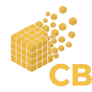
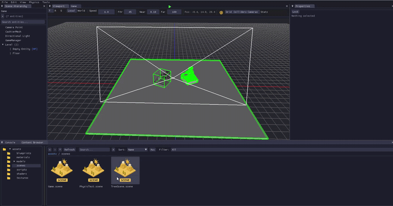
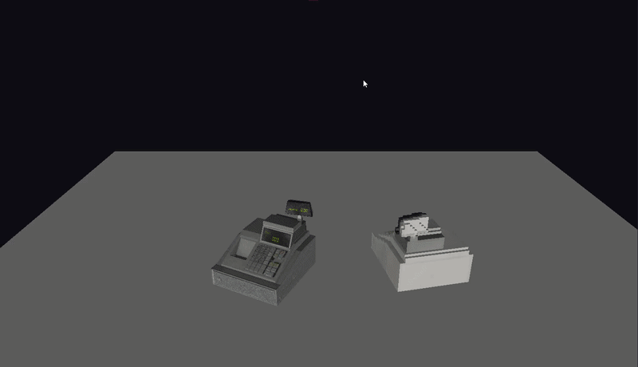
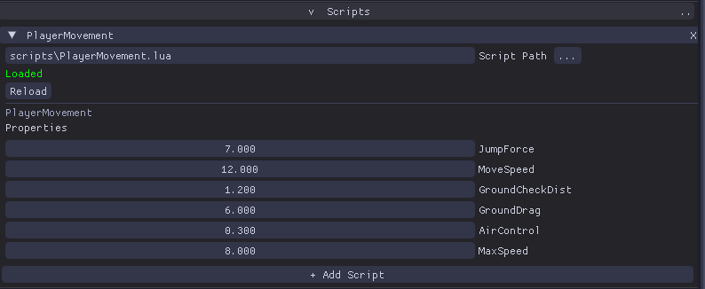
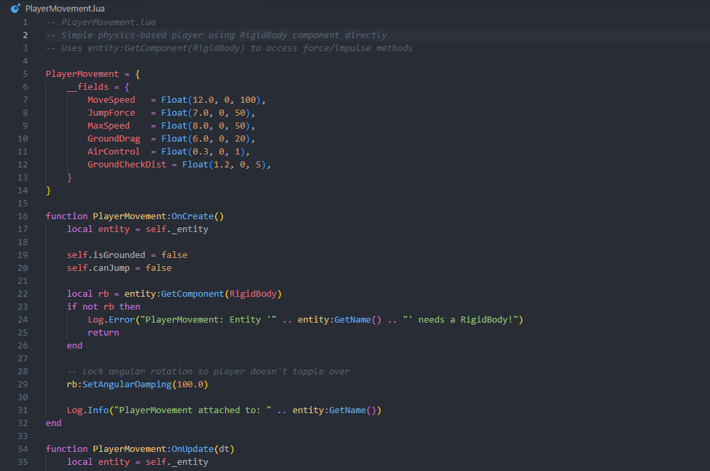
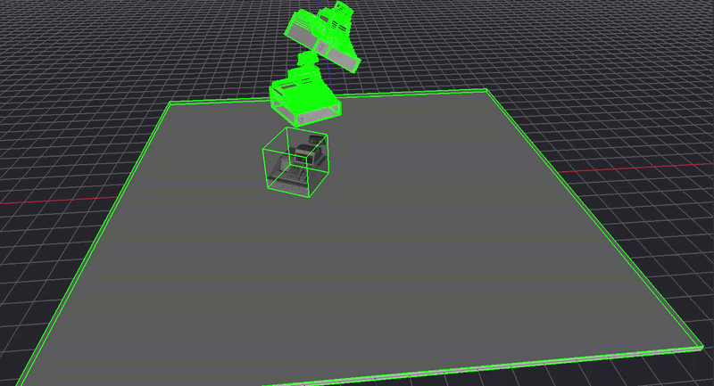
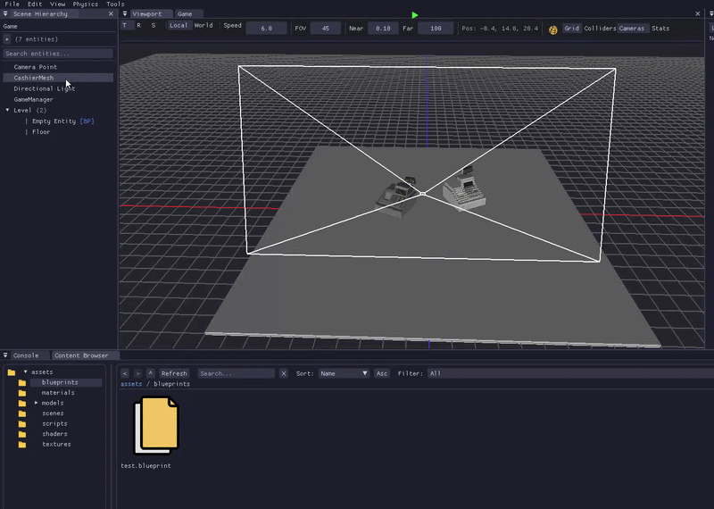
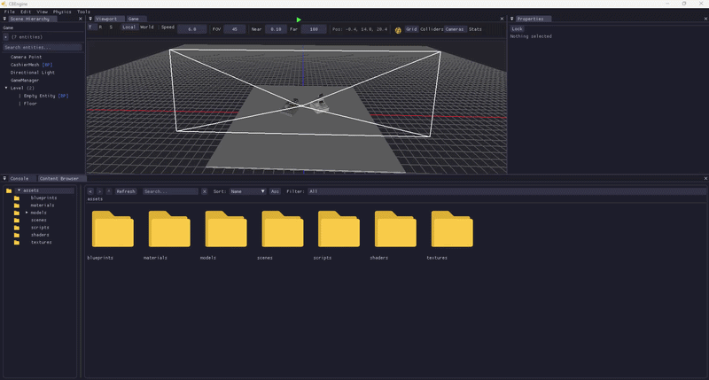
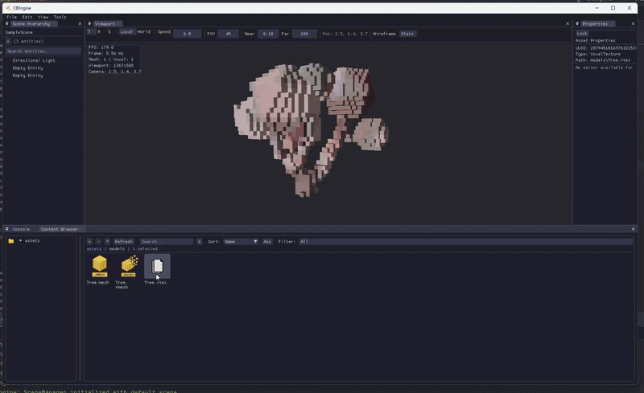

<p align="center">
  
</p>

<h1 align="center">CBEngine</h1>

<p align="center">
  <b>A custom 3D game engine built from scratch in C++17 with a focus on voxel-based workflows</b>
</p>

<p align="center">
  
  
  
  
  
  
</p>

---

<p align="center">
  
</p>

## About

CBEngine is a **custom-built 3D game engine** developed entirely from scratch in **C++17** using **OpenGL**. It features a full editor with docking UI, PBR rendering, an entity-component system, a unique **mesh-to-voxel pipeline** with per-voxel material painting, a **Jolt Physics** integration, and a **Lua scripting system** for game logic. The engine is designed for creating voxel-style games with destructible environments.

---

## Features

### PBR Rendering

Physically-Based Rendering using Cook-Torrance BRDF with support for albedo, normal, metallic, and roughness texture maps. Includes ACES tonemapping, directional lighting, and smooth/flat shading control.

---

### Lua Scripting

Full **Lua 5.4** scripting integration via **sol2** with hot-reload support. Scripts are attached to entities and executed each frame.

- **Multi-script per entity** — attach as many scripts as you need
- **Hot-reload** — scripts automatically reload when the file changes on disk
- **Field reflection** — expose typed fields (number, string, bool, Vec3, Entity) that appear in the editor and serialize to the scene file
- **GameManager singleton** — a special entity/component for global game state, accessible from any script via `scene:GetGameManager()`
- **Full Lua API** — access to input, transform, physics, raycasting, logging, debug drawing, and all components

```lua
-- Example: simple script
function OnStart(entity)
    self.speed = 5.0
end

function OnUpdate(entity, dt)
    local pos = entity:GetTransform().position
    if Input.IsKeyPressed(Key.W) then
        pos = pos + Vec3(0, 0, -self.speed * dt)
        entity:GetTransform().position = pos
    end
end
```

```lua
-- GameManager example (inherits base GameManager class)
local MyGame = GameManager:Extend("MyGame")

function MyGame:OnStart()
    self.score = 0
end

function MyGame:AddScore(points)
    self.score = self.score + points
    Log.Info("Score: " .. self.score)
end

return MyGame
```

<p align="center">
  
</p>

<p align="center">
  
  
</p>

---

### Physics System (Jolt Physics)

Full **Jolt Physics** integration with a fixed-timestep simulation at 60 FPS.

- **Body types** — Static, Dynamic, Kinematic
- **Collider shapes** — Box, Sphere, Capsule, VoxelCompound (auto-generated from voxel meshes)
- **Collision callbacks** — `OnCollisionEnter`, `OnCollisionStay`, `OnCollisionExit` exposed to Lua scripts
- **Raycasting** — scene raycasts with physics layer masks, callable from Lua or C++
- **16 user physics layers** — selectively filter which objects collide with each other
- **VoxelCompound shapes** — voxel meshes are automatically converted to optimized Jolt compound shapes

<p align="center">
  
</p>

---

### Blueprint / Prefab System

A prefab system for creating reusable entity hierarchies.

- **YAML serialization** — blueprints stored as `.blueprint` files
- **Instancing** — drag blueprints from the Content Browser into the scene
- **Instance change detection** — overrides per-instance are tracked and preserved on re-import
- **Full hierarchy support** — blueprints can contain parent/child entity trees with all components

<p align="center">
  
</p>

---

### Mesh-to-Voxel Conversion

Automatically convert any 3D model (FBX, OBJ, GLTF) into a voxel representation. Supports solid and surface voxelization modes, with texture color sampling that maps the original model's textures onto each voxel.

<p align="center">
  
</p>

---

### Voxel Texture Editor

A dedicated editor for painting per-voxel materials. Features a **2D slice view** for layer-by-layer editing (Dwarf Fortress style), custom brush creation, a color palette system with 256 entries, and real-time mesh rebuilding as you paint.

<p align="center">
  
</p>

---

### Mesh Import Pipeline

A full import wizard for 3D models with live preview, voxelization settings, material slot editing, and async voxelization preview. Outputs to processed `.mesh` or voxelized `.vmesh` formats.

---

### Custom Editor

A full-featured ImGui-based editor with docking layout, including:

- **Scene Hierarchy** — Entity tree with parent/child relationships and drag-and-drop reparenting
- **Properties Panel** — Component editing with custom widgets per component type
- **Content Browser** — File browser with thumbnails, search, filters, sorting, and drag-and-drop import
- **Viewport** — 3D scene view with entity picking (click to select) and transform gizmos
- **Game Viewport** — Dedicated play-mode view showing the scene through the game camera
- **Console** — Log output with level filtering
- **Profiler** — Real-time FPS graph and per-scope profiling

<p align="center">
  
</p>

---

### Entity Component System

Built on **EnTT** with a full entity hierarchy system including parent/child transforms with world-space caching. Comes with built-in components:

| Component | Description |
|---|---|
| **TransformComponent** | Position, rotation, scale with parent/child hierarchy |
| **MeshRendererComponent** | Mesh + material + shader rendering |
| **VoxelRendererComponent** | Voxel mesh rendering with palette support |
| **DirectionalLightComponent** | Directional lighting with intensity control |
| **CameraComponent** | Perspective camera with FOV and clip plane settings |
| **RigidBodyComponent** | Physics body (Static / Dynamic / Kinematic) with mass, damping, restitution |
| **ColliderComponent** | Physics collider shape (Box, Sphere, Capsule, VoxelCompound) |
| **ScriptComponent** | One or more Lua scripts attached to an entity |
| **GameManagerComponent** | Marks an entity as the scene-wide game manager singleton |
| **BlueprintInstanceComponent** | Prefab instance with per-instance override tracking |

---

### Palette-Based Voxel Materials

A 256-entry color palette system where each entry stores color, metallic, roughness, and emission values. Includes automatic color quantization, palette texture generation, and material type classification (Stone, Wood, Metal, Glass, Marble).

<p align="center">
  
</p>

---

### Asset Pipeline

A complete asset management system with:

- **UUID-based tracking** with `.meta` files for every asset
- **Hot-reloading** — Shaders, materials, textures, meshes, and scripts auto-reload on file changes
- **File watcher** — Automatic change detection using native Windows APIs
- **Custom binary formats** — `.mesh` (processed meshes), `.vmesh` (voxel meshes), `.vtex` (voxel textures)
- **YAML scene serialization** — Human-readable `.scene` files
- **Blueprint assets** — `.blueprint` prefab files with full hierarchy serialization

---

### Scene Serialization

Full scene save/load with YAML-based `.scene` files. All entities, components, hierarchies, asset references, and script field values are serialized and restored.

---

### Shader System

Single-file GLSL shader format using `#type` directives to define vertex and fragment shaders in one file. Supports automatic compilation, uniform management, and hot-reloading.

```glsl
#type vertex
// vertex shader code...

#type fragment
// fragment shader code...
```

---

### Material System

PBR material files (`.mat`) with albedo, metallic, roughness, smooth shading, and texture map slots. Materials can be created programmatically or loaded from files, and support hot-reloading.

---

### Debug Drawing

Runtime debug visualization system accessible from C++ and Lua scripts:

- Draw lines, boxes, and spheres in world space
- Automatic collider visualization overlay (toggle in editor)
- All debug shapes are drawn as overlays and cleared each frame

---

### Profiling & Debugging

Chrome DevTools compatible profiling with per-function and per-scope macros. Includes a real-time ImGui profiler panel with FPS history graph (120 frames), toggled with **F3**.

---

## Tech Stack

| Category | Technology |
|---|---|
| **Language** | C++17 |
| **Graphics** | OpenGL 4.5 |
| **Windowing** | GLFW |
| **GL Loader** | Glad |
| **UI** | Dear ImGui (Docking) |
| **Gizmos** | ImGuizmo |
| **Math** | GLM |
| **Logging** | spdlog |
| **3D Loading** | Assimp (FBX, OBJ, GLTF, GLB) |
| **Image Loading** | stb_image (PNG, JPG, TGA, BMP) |
| **ECS** | EnTT |
| **Physics** | Jolt Physics |
| **Scripting** | Lua 5.4 + sol2 |
| **Serialization** | yaml-cpp |
| **Build System** | Premake5 / Visual Studio 2022 |

---

## Roadmap

- [ ] Destructible voxel environments
- [ ] Fragment spawning on impact
- [ ] Point & spot lights
- [ ] Shadow mapping

---

## Playing the Example Game

CBEngine ships with a playable first-person puzzle level — **Flamethrower Puzzle** (`Game.scene`).  
Open the scene in the editor, then press **F5** (or the Play button in the toolbar) to start.

---

### Objective

You are on a chain of sky-island platforms connected by narrow bridges.  
**Fight through four floors of wall turrets** to reach the goal platform and win.  
One floor has a wooden wall blocking the path — burn it down to proceed.  
Run out of health and play mode stops immediately.

---

### Controls

| Key / Button | Action |
|---|---|
| **W A S D** | Move |
| **Mouse** | Look around |
| **Left Shift** | Sprint |
| **Space** | Jump |
| **Left Click** | Fire current weapon |
| **1** | Switch to **Impact** bullet |
| **2** | Switch to **Fire** bullet |
| **3** | Switch to **Explosion** bullet |
| **4** | Switch to **Flamethrower** bullet |
| **Esc** | Release mouse cursor |
| **Left Click** *(cursor free)* | Re-lock cursor and resume play |

---

### Level Walkthrough

**Floor 1**
Eliminate all wall turrets to clear the floor and advance.

**Floor 2**
Burn through the wooden wall blocking the path, then take out the turrets guarding the area.

**Floor 3**
Eliminate the remaining turrets to open the way forward.

**Floor 4 — Goal**
Step onto the **win plate**.
Play mode stops and `=== YOU WIN! ===` is printed to the console.

---

### Tips

- Use **key 4** (Flamethrower bullet) to burn the wooden wall on Floor 2.
- Turrets have limited range and require **line of sight** — move behind cover to break their aim.
- Turrets can be destroyed with any bullet type (keys **1 / 2 / 3 / 4**).
- The wooden wall on Floor 2 is immovable until burned enough — keep firing until it topples.
- Falling off the edge respawns you at the last checkpoint — turret damage is what ends the run.

---

## Building

**Requirements:** Visual Studio 2022, Windows 10/11

```bash
# Generate project files
./GenerateProject.bat

# Build via MSBuild
msbuild CBEngine.sln /p:Configuration=Debug /p:Platform=x64
```

Or open `CBEngine.sln` in Visual Studio and build from there.

---

<p align="center">
  Built from scratch with C++ and OpenGL
</p>
