# Architecture Overview

This document describes the high-level architecture of the PewPew engine, including system diagrams and design patterns.

## Table of Contents

- [System Architecture](#system-architecture)
- [Application Lifecycle](#application-lifecycle)
- [Renderer Architecture](#renderer-architecture)
- [Event Flow](#event-flow)
- [Layer System](#layer-system)
- [Memory Management](#memory-management)
- [Design Patterns](#design-patterns)

---

## System Architecture

The engine follows a layered architecture with clear separation between core systems, platform abstraction, and client applications.

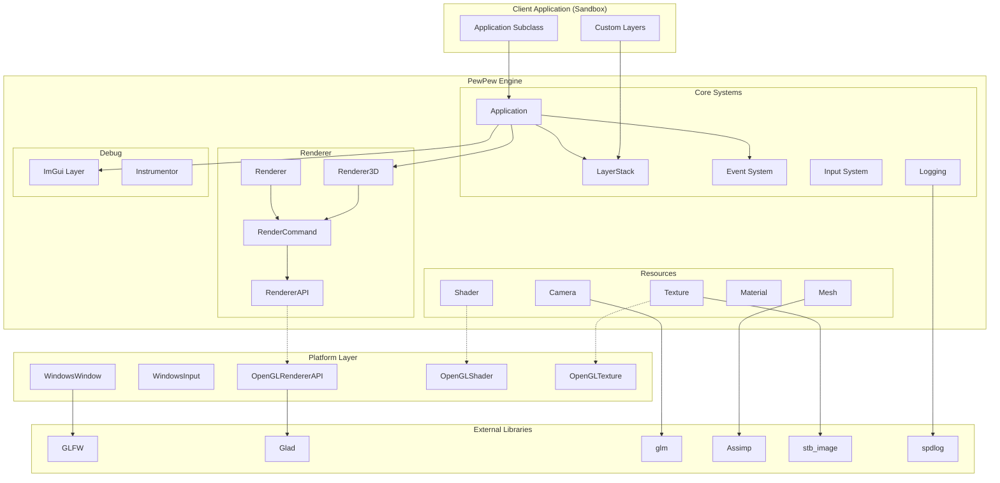

### Component Responsibilities

| Component | Responsibility |
|-----------|----------------|
| **Application** | Main loop, window management, layer orchestration |
| **LayerStack** | Ordered collection of game logic layers |
| **Event System** | Type-safe event creation and dispatching |
| **Renderer3D** | 3D scene rendering with PBR lighting |
| **RendererAPI** | Graphics API abstraction (OpenGL) |
| **Resources** | GPU resource management (shaders, textures, meshes) |

---

## Application Lifecycle

The application follows a standard game loop pattern with initialization, update, render, and shutdown phases.

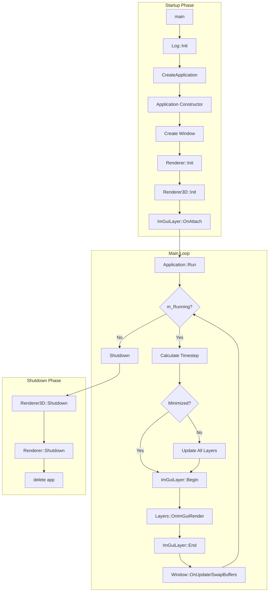

### Frame Timeline

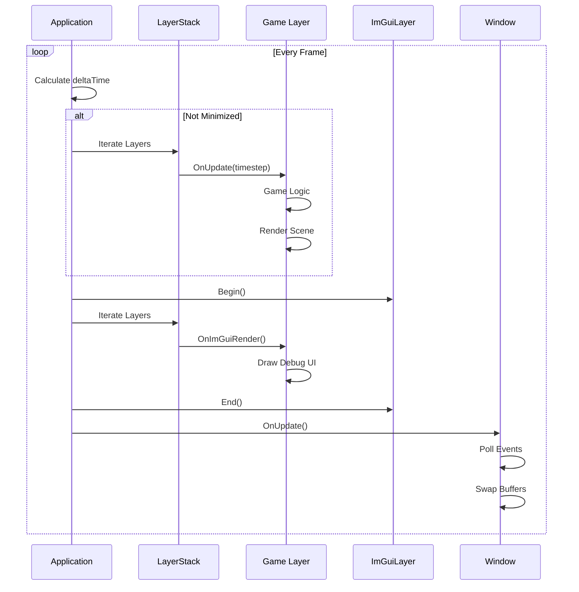

---

## Renderer Architecture

The renderer uses a multi-layer abstraction to separate high-level rendering concepts from low-level graphics API calls.

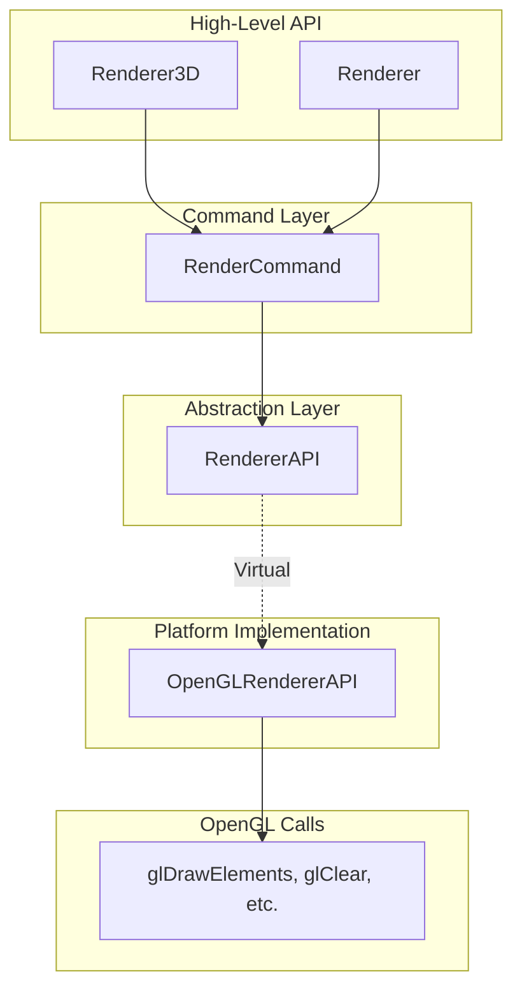

### Render Pipeline Flow

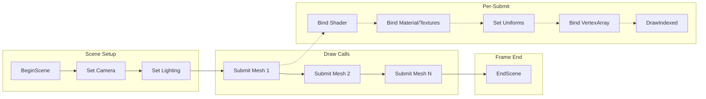

### Resource Ownership

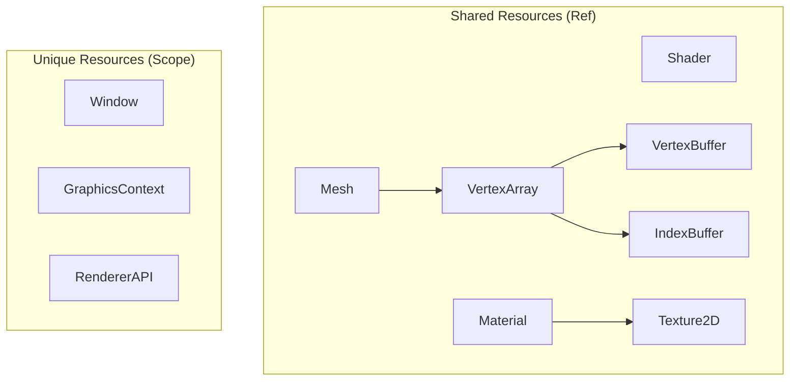

---

## Event Flow

Events propagate from the window through the application to individual layers.

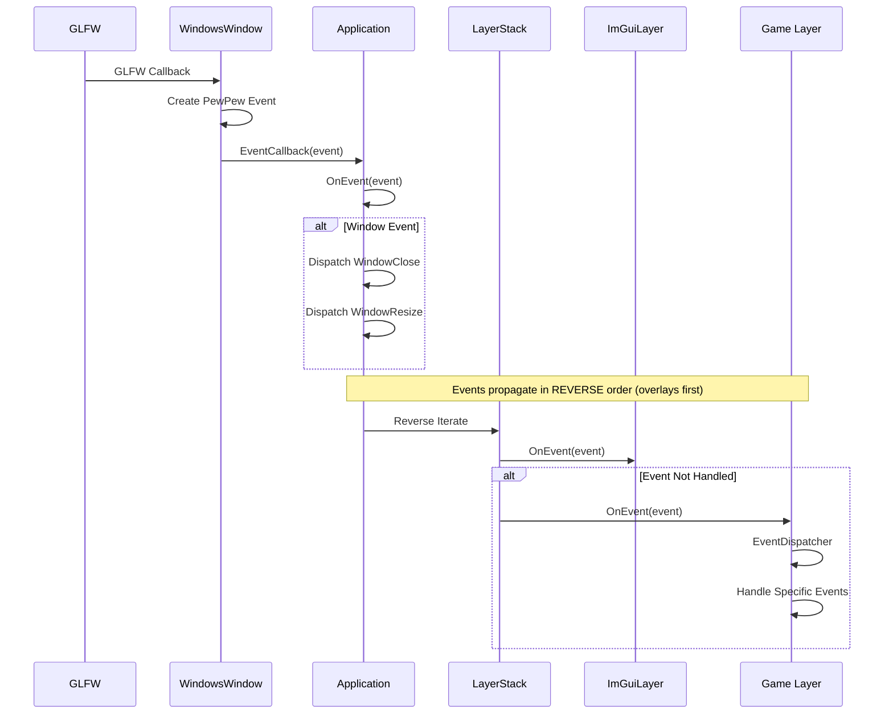

### Event Types Hierarchy

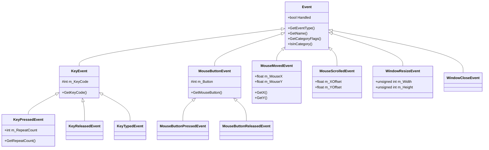

---

## Layer System

Layers organize game logic into modular, stackable components.

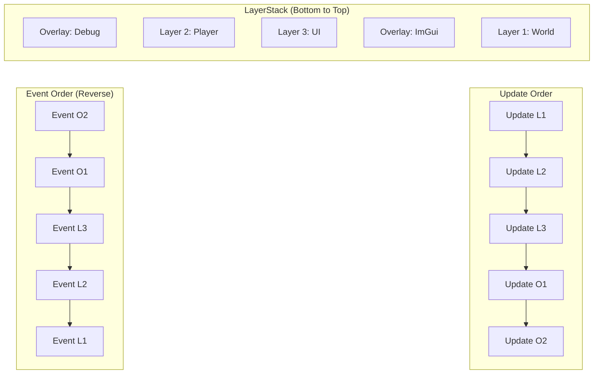

### Layer Lifecycle

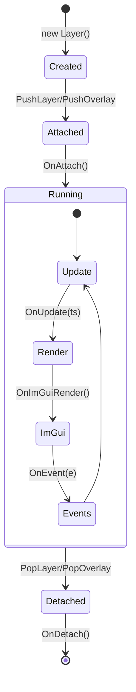

---

## Memory Management

The engine uses two smart pointer types for resource management.

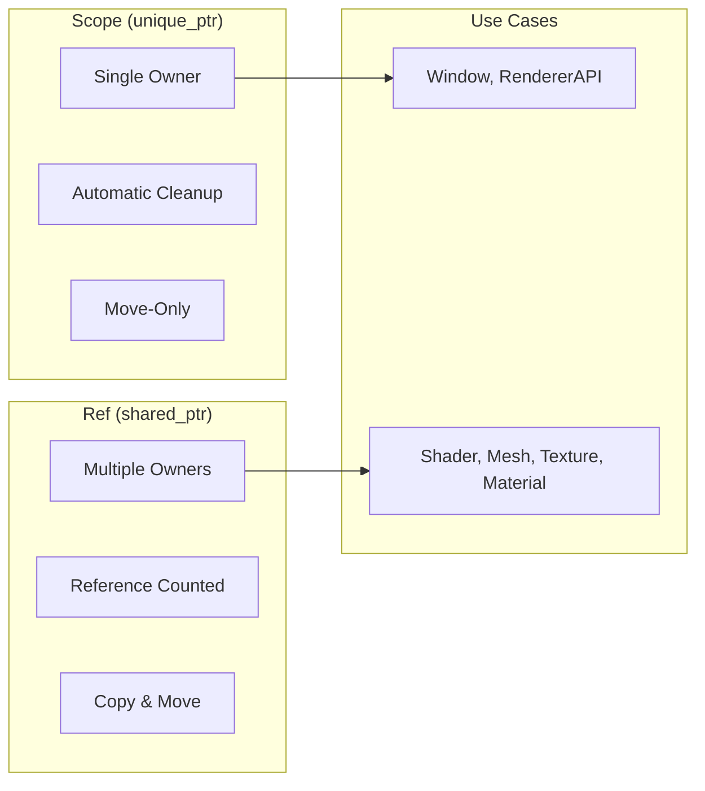

### Factory Pattern Usage

```cpp
// Scope - Single ownership, deterministic cleanup
Scope<Window> window = Window::Create(props);

// Ref - Shared ownership, reference counted
Ref<Shader> shader = Shader::Create("path/to/shader.glsl");
Ref<Mesh> mesh = Mesh::Load("path/to/model.fbx");
Ref<Texture2D> texture = Texture2D::Create("path/to/image.png");
```

---

## Design Patterns

### Patterns Used

| Pattern | Usage | Example |
|---------|-------|---------|
| **Singleton** | Global access to core systems | `Application::Get()`, `Log::GetCoreLogger()` |
| **Factory** | Platform-agnostic resource creation | `Shader::Create()`, `Window::Create()` |
| **Strategy** | Swappable implementations | `RendererAPI` → `OpenGLRendererAPI` |
| **Observer** | Event system | `EventDispatcher`, `EventCallback` |
| **RAII** | Resource cleanup | `InstrumentationTimer`, smart pointers |
| **Command** | Deferred rendering | `RenderCommand` static methods |
| **Facade** | Simplified high-level API | `Renderer3D::Submit()` |

### Class Relationships

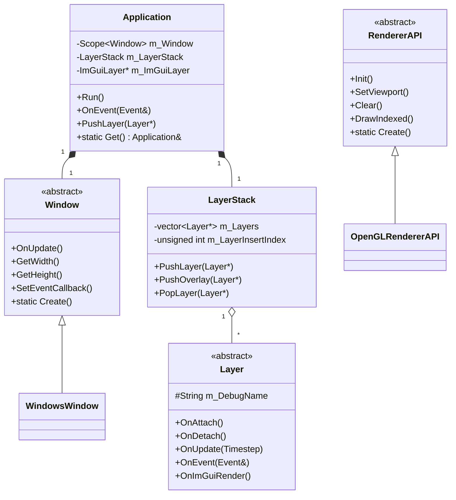

---

## Platform Abstraction

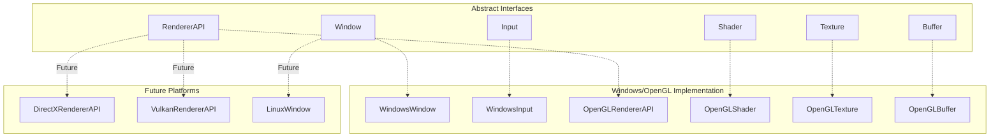

---

## Next Steps

- [Getting Started](./GETTING_STARTED.md) - Set up your development environment
- [Core Systems](./CORE_SYSTEMS.md) - Deep dive into engine systems
- [Renderer Guide](./RENDERER.md) - Learn the rendering pipeline
